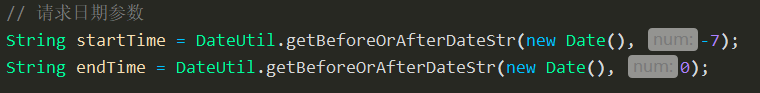

# PERSISTENCE-CONSUMER

## 前言

* 目前有两个接口的数据需要同步，对应的项目名为transfer-data-api与transfer-data-statistics
* 以下根据provider格式数据进行同步，后续如果线上接口更新，再根据json格式进行对应迭代
* 接口数据api与statistics分库存储(运营需求)

## 数据

* api

  * 请求

    * 日期参数，获取近3天数据

      

  * 响应

    * 接口返回4张表的数据：rpLoanLabelBatchCheckList、rpLoanLabelCheckList、rpLoanSmsTemplateCheckList、rpLoanStatisticsDayList

  * 存储

    * 同步存储的表名

      

    * 响应数据中有4个表的数据，同步结果保存为5张表的数据(rpLoanLabelBatchCheckList保存两张表，其中一个通用规则保存，另一个表为当天全量数据)

    * 通用规则

      * 所有表保存前先根据日期条件删除对应记录，再进行保存

    * 个性规则

      * LabelBatchCheckSaveImpl

        

      * LabelCheckAllSaveImpl

        

      * LabelCheckSaveImpl

        

      * SmsTemplateCheckSaveImpl

        

      * StatisticsDaySaveImpl

        

  * 格式

  

* statistics

  * 请求

    * 日期参数，获取近3天数据

      

  * 响应

    * 接口返回1张表的数据：statistics_info

  * 存储

    * 通用规则
      * 插入数据前先删除该段时间记录

  * 格式

  

